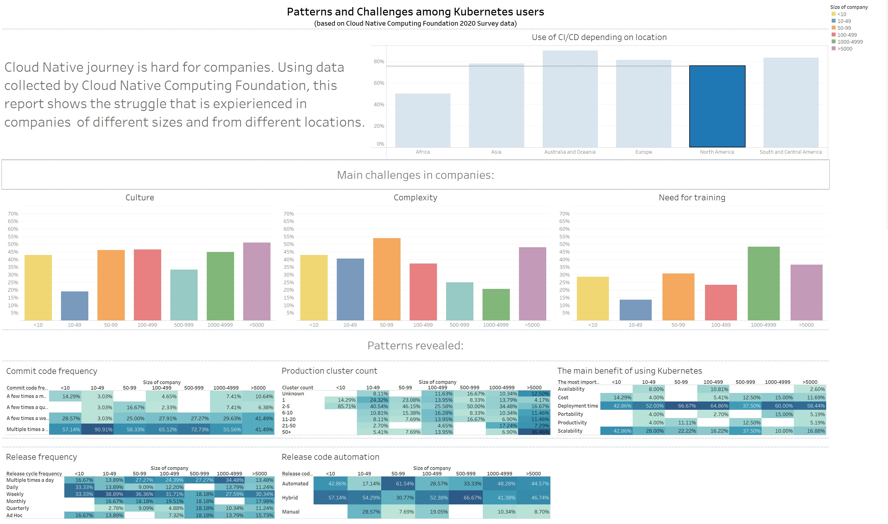

# Patterns and Challenges among Kubernetes users (based on World 2020 Cloud Native Computing Foundation Survey data)

## Summary

This work has been done for the for the Interactive Media Design and Data Visualisation course. [The original report](./Report.md) is cleaned up and attached to the repository.

The data for this report is collected from [CNCF 2020 survey](https://github.com/cncf/surveys/blob/main/cloudnative/Cloud_Native_Survey_1H_2020.csv).

The data was converted to a more parseable format using Excel and imported in Tableau. [The result Excel file](CNCFSurvey.xlsx), [CSV file](CNCFSurveyParsed.csv) and [Tableau file](Book3.twbx) are attached. Tableau file is also available [online](https://public.tableau.com/views/PatternsandChallengesamongK8susers/PatternsandChallengesamongKubernetesusers?:language=en-GB&:display_count=n&:origin=viz_share_link).

There are several discoveries made from the data.

* Use CI/CD is slightly higher for companies based in Europe rather than USA. This might be connected with the numerous small(less than 50 people ) and tiny (less than 10 people) who filled report from USA.
* Developers in small companies spend more time writing code and can commit the code more often. On the second place, people in large companies (500-999).
* Majority of the companies have only several production clusters with the difference in large (100-499 people) and enormous companies(>5000) where people work on tooling supporting multiple clusters.
* The companies based in Asia do not see the culture challenges as big as in North America and Europe.
* One more difference for the Asian companies is the release cycle. They release new version once a month more often than other continents.
* The deployment time is the main benefit of using Kubernetes. The only companies with 100-499 and less than 10 people in North America have it in the same place as scalability.

Fun fact that is visible from the data is that if the company does not use CI/CD, the people do not know how many clusters does the company have. This might be connected to the strict role separation and manual deployments.

See more information in dashboard

