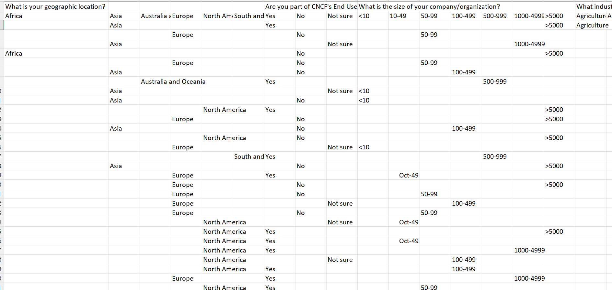
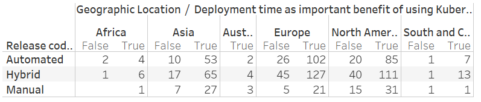
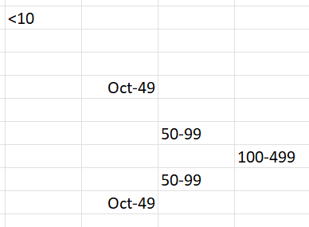
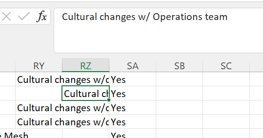
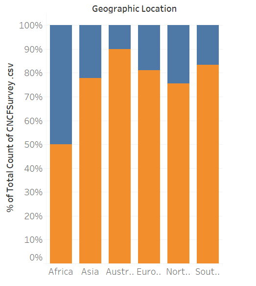

# Patterns and Challenges among Kubernetes users (based on World 2020 Cloud Native Computing Foundation Survey data)

## by Iryna Slynko

## Table of contents

- [CA Summary](#ca-summary)
- [Background](#background)
- [Data set(s)](#data-sets)
- [Seven stages](#seven-stages)
  - [Acquire](#acquire)
  - [Parse](#parse)
  - [Filter](#filter)
  - [Mine](#mine)
  - [Represent](#represent)
  - [Interact](#interact)
- [Problems and solutions](#problems-and-solutions)
  - [Wrong data format](#wrong-data-format)
  - [Unparseable symbols](#unparseable-symbols)
  - [Missing data in surveys](#missing-data-in-surveys)
  - [Using several fields to specify the same data](#using-several-fields-to-specify-the-same-data)
  - [Hiding excessive information](#hiding-excessive-information)
- [Conclusion](#conclusion)

## CA Summary

Cloud Native journey is a popular but yet challenging journey for companies. In the current report we decided to analyse the data collected during the 2020 international survey by Cloud Native Computing Foundation (CNCF). While the official report[CNCF, 2021] by CNCF summaries overall tendency in each of the surveyed question, we decided to investigate the raw data and see if there are any interesting patterns or correlations. Finally, our aim was to visualize the patterns and highlight challenges occurring among Kubernetes users and present the findings on the interactive dashboard

## Background

Cloud Native Computing Foundation(CNCF) takes surveys every year. They open surveys for the public and collect different metrics about a typical environment and use of applications that are part of CNCF.

[Original CNCF report](https://www.cncf.io/wp-content/uploads/2020/11/CNCF_Survey_Report_2020.pdf) summarizes the key tendencies, displays and contrasts the total for each parameter. However, we wanted to investigate further and find correlations between the surveyed data as well as visualize and filter those findings for display on the dashboard. We also were interested in patterns amongst companies that use Kubernetes in production.

## Data set(s)

Cloud Native Computing Foundation rules allow members to collect data and share it. The raw data is located in [CNCF surveys git repository in CSV format](https://github.com/cncf/surveys/blob/main/cloudnative/Cloud_Native_Survey_1H_2020.csv).

## Seven stages

### Acquire

The raw data comes from a CSV file was exported from Google Forms results. It has two header lines - one with the questions and the other one with answers for the questions with choices.

_Fig. 1 Data format_

### Parse

Parsing data was done using Excel, because the standard CSV parsers do not work with multiple headers.

There are several approaches to choose non-empty data from several cells, in the end the most usable format was to use the `INDEX` function to select non-empty values. This also allowed us to simplify the fix of several problems. There were several features of the data that were chosen by comparison of the data with the possible values in the corresponding column. For example, to select "Use Kubernetes in production" the check was to compare that the value in the columns equals to "Using in production". This allowed us to get boolean value in the columns for the feature.

We have chosen the following features:

- Geographic location;
- Size of the company - there might be some patterns that exist in big and very big companies;
- Commit code frequency - this might show how hard it is to implement the change;
- Release frequency - this should correlate with release automation and continuous delivery;
- Release cycle automation - this should show if the company can invest in improving the process;
- Challenges in using Kubernetes: culture, complexity, need for training. The user could fill several columns at the same time;
- The main benefit of using Kubernetes in production - some of the benefits such as portability or cost should be more common in large companies;
- Deployment time as an important benefit (that has at least 3 out of 5 points);
- Deploying stateful applications(this might correlate with deploying legacy applications);
- Use Kubernetes in production;

### Filter

The next step was to filter the data. For the research, Kubernetes production users were chosen. The Excel FILTER function was chosen. It allows filter rows based on the logical criteria. The criteria in our case was checking the value in the "Use Kubernetes in Production" column of the processed data.

### Mine

There were several hypothesis:

- Use of CI/CD in the company dependent on their size
- Companies located in Asia region will do less CI/CD
- Using stateful applications will correlate with lower CI/CD usage for big companies. This can happen because legacy applications are usually stateful.
- Release automation should be lower with the company size.
- Commit code frequency should also decrease with the company size.

To check these hypotheses and others the simple Tableau sheets were created.

_Fig. 2 Compare deployment time as important benefit for different geographic locations_

### Represent

The two representation formats were chosen:

- For the single yes/no features(challenges in companies) - single side-by-side bars diagram was chosen.
    The diagram that shows the data across geographic locations has only the single color for each of the bars.
    The diagrams that show the data across different company sizes have the same multiple colours for each company size of every diagram.
    This allows us to easily identify the important data regarding each of the company sizes on each of the diagrams.
    Additionally, the axis were made static and limited to 75%. This helps compare different challenges and differences when using filters.
- For the options with multiple options, such as release frequency, the highlight table was chosen to focus on most important correlations.

### Interact

The interaction allows us to filter data by continent.

## Problems and solutions

There were the following problems when processing the data.

### Wrong data format

Excel automatically formats some ranges into the dates.

_Fig. 3 The wrong data format_

Initially, the data was processed using nested if, later we were able to use functionality of the Excel index format. The data was fixed manually in the header row of the raw data, then using the index function the corresponding item from the header was extracted.

### Unparseable symbols

_Fig. 4 Unparseable symbol_

For some reason, Excel read wrong symbols from the CSV. I fixed it by using replace functionality of Excel.

### Missing data in surveys

The survey had only two required questions: geographic location and size of company. The  other items could be empty, which broke Excel parsing functions. We have used the `IFNA` function to replace NA values with empty values.

### Using several fields to specify the same data

The challenges section supported write-in answers. To parse it properly, several substring search functions were used.

_Fig. 5 Cultural changes in a write-in column_

### Hiding excessive information

_Fig. 6 Stacked bar graph_

The stacked bar graph did not allow to hide the unimportant answer "no". The extra part of the bar looked excessive and misleading. The side-by-side bar looked better but it had the confusing false part. It is impossible to filter the false bar and keep the percentage, since then the percentage would get calculated using the filtered data. The working approach was to use hide functionality and use the same colour for each of the countries.

## Conclusion

Using Cloud Native technologies is popular, but hard for the companies. There are several discoveries made from the data.

Use CI/CD is slightly higher for companies based in Europe rather than USA. This might be connected with the numerous small(less than 50 people ) and tiny (less than 10 people) who filled report from USA.

Developers in small companies spend more time writing code and can commit the code more often. On the second place, people in large companies (500-999).

Majority of the companies have only several production clusters with the difference in large (100-499 people) and enormous companies(>5000) where people work on tooling supporting multiple clusters.

The companies based in Asia do not see the culture challenges as big as in North America and Europe.

One more difference for the Asian companies is the release cycle. They release new version once a month more often than other continents.

The deployment time is the main benefit of using Kubernetes. The only companies with 100-499 and less than 10 people in North America have it in the same place as scalability.

Fun fact that is visible from the data is that if the company does not use CI/CD, the people do not know how many clusters does the company have. This might be connected to the strict role separation and manual deployments.

Our recommendation is to continue the analysis by comparing the historic data as well as collecting more data in future surveys to reflect practices of more companies in different geographic locations.
